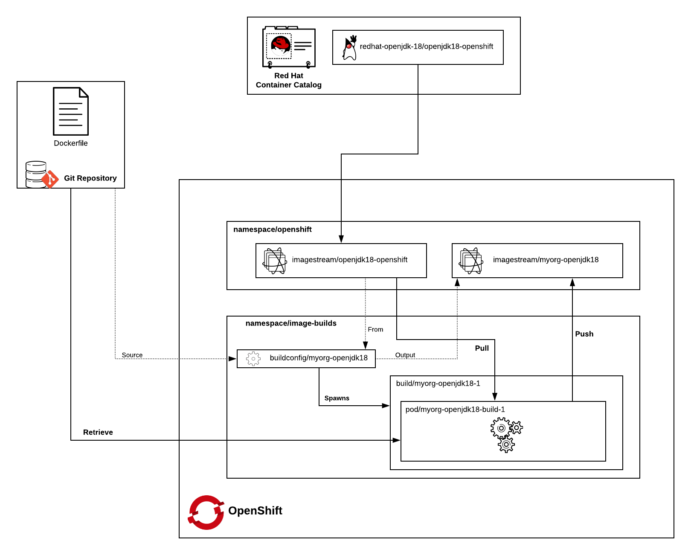

# Tooling for Setting up a Proper Image Management Workflow in OpenShift

The purpose of this project is to be used as a bootstrap for an custom base image build workflow.

## Architecture

In order to simulate a real world enterprise use case, we define two different _actors_ with different levels of ownership of the process.

- An _Operator_ in this case is someone who has admin access to the OpenShift cluster (e.g. a `cluster-admin`)
- An _Image Builder_ is a generic term for the actor in the organization who has ownership of Base Image Builds. This role would typically have restricted rights to the cluster. In this case, we'll say that an _Image Builder_ has `admin` rights on certain projects related to image building.

The projects here contain the following structures:

- An [OpenShift Applier](https://github.com/redhat-cop/openshift-applier) inventory for the Operator portion of the automation
- An [OpenShift Applier](https://github.com/redhat-cop/openshift-applier) inventory for the Image Builder portion of the automation.
- Two sample base image builds
  - [myorg-openjdk18](./myorg-openjdk18) - A sample showing how an org might customize the Red Hat jdk image to insert their corporate CAs
  - [myorg-eap-oraclejdk](./myorg-eap-oraclejdk) - A sample showing an org that has replaced OpenJDK with OracleJDK in the Red Hat image.

The image build workflow has the following components:

- An `image-builds` project which is where the custom images will be built
- A `BuildConfig` for each image which defines how the images will be built
- An `ImageStream` which will get created in the `openshift` namespace by default
- A `RoleBinding` to allow the _builder_ `ServiceAccount` to push images into another namespace (e.g. `openshift`)

The workflow we will deploy looks something like this:



In this workflow, we use the `image-builds` namespace as the home for running builds. This namespace would be private, accessible only to our _Image Builder_ actor. However, both the Red Hat base images, and the customized `myorg-` images will be hosted in the `openshift` namespace, thus being readable from all other namespaces, and making the resulting content more accessible to the organization. The `buildConfigs` also utilize [_image change triggers_](https://docs.openshift.com/container-platform/3.7/dev_guide/builds/triggering_builds.html#image-change-triggers) to automatically rebuild any time a change is detected in an upstream image. In this way, we ensure that all of our images are always up to date with the latest parent images.

## Deploying the Workflow

This project uses [Ansible](https://www.ansible.com/) and [Ansible Galaxy](http://docs.ansible.com/ansible/latest/reference_appendices/galaxy.html) to deploy the workflow.

First thing to do is to install the prerequisites:
```
cd image-management/
ansible-galaxy install -r requirements.yml -p galaxy
```

Next, we can run the _Operator_ inventory to create the projects and map roles
```
ansible-playbook -i applier/operator-inventory/ galaxy/openshift-applier/playbooks/openshift-cluster-seed.yml
```

Finally, we can run the _Image Builder_ inventory, which will deploy the Build Configs, and kick off the image builds.
```
ansible-playbook -i applier/image-builder-inventory/ galaxy/openshift-applier/playbooks/openshift-cluster-seed.yml
```

Once done, you can track the status of the builds using `oc status -n image-builds` or by looking in the Web Console, under _Builds_.
